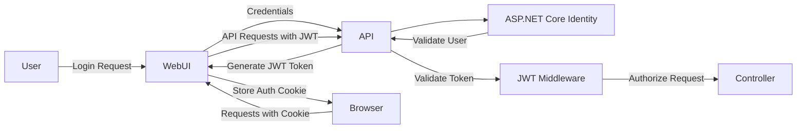
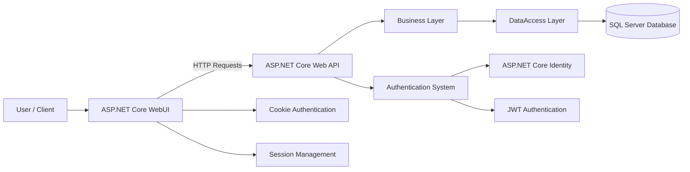
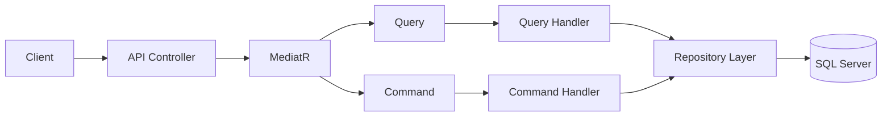

# 🛒 E-Commerce Web Application

Bu proje, **ASP.NET Core 8** kullanılarak geliştirilmiş, katmanlı mimariye sahip bir e-ticaret uygulamasıdır. Admin Paneli ve Kullanıcı Paneli bulunmaktadır.
Amaç, modern yazılım geliştirme pratiklerini uygulayarak öğrenmek ve gerçek hayata yakın bir sistem tasarlamaktır.  

---

# 🛒 Özet

- Site içerisinde ürünler listelenmektedir ve kullanıcı seçimine göre **renk, kategori, beden ve fiyat** filtreleme yapılabilir.  
- Ürün sepete eklenmek istendiğinde, kullanıcı **giriş yapmamışsa** "Giriş Yapınız" uyarısı alınır ve kullanıcı **Giriş / Kayıt ekranına yönlendirilir**.  
- Giriş yapan kullanıcı sepetini görüntülemek istediğinde:  
  - **Aktif sepet yoksa:** Yeni sepet oluşturulur, **Status** durumu `true` atanır ve kullanıcı ürün ekledikçe sepete eklenir.  
  - **Aktif sepet varsa:** Sepet sayfasında mevcut ürünler listelenir; kullanıcı yeni ürün eklediğinde **mevcut ürün güncellenir veya eklenir**. Bu işlemler **AJAX ile senkronize** şekilde yapılır.
- Sipariş Durumu ve Ödeme Durumu Takibi yapılmaktadır.

### 📊 Sipariş & Ödeme Durumları  

| **Aksiyon**                  | **OrderStatus**        | **PaymentStatus**       |
|-------------------------------|------------------------|--------------------------|
| Kullanıcı siparişi tamamlar   | Await Payment (Ödeme Bekleniyor) | Pending (Bekleniyor)    |
| Kullanıcı ödemeyi yapar       | Processing (İşleniyor) | Paid (Ödendi)           |
| Admin siparişi kargolar       | Shipped (Kargolandı)   | Paid (Ödendi)           |
| Sipariş teslim edilir         | Delivered (Teslim Edildi) | Paid (Ödendi)        |
| Sipariş iptal edilir          | Cancelled (İptal Edildi) | Pending / Paid (Duruma göre) |
| Admin ödeme iadesi yapar      | Cancelled / Delivered (Duruma göre) | Refunded (İade Edildi) |

## 🛠️ Kullanılan Teknolojiler

### 🔹 Ana Teknolojiler
- **ASP.NET Core 8 (MVC + Web API)** → Uygulamanın temel çatısı, hem API hem WebUI geliştirme sağlandı.  
- **Entity Framework Core (Code First)** → Veritabanı işlemleri yönetildi, entityler arasında ilişkiler (1-N, N-N) kuruldu ve LINQ ile sorgulamalar yapıldı.  
- **Identity & JWT Authentication** → Kullanıcı giriş/çıkış süreçlerinde token tabanlı kimlik doğrulama yapıldı; ayrıca admin controller tarafında yetkilendirme ve sepet işlemlerinde güvenlik sağlandı.
  **JWT Token Konfigürasyonu** → API üzerinde gelen JWT token'ların doğrulanması sağlandı. 
  Token’ın **issuer** ve **audience** değerleri kontrol edildi, **yaşam süresi (lifetime)** doğrulandı ve token’ın uygulamaya ait olduğu **security key ile garanti altına alındı**. 
  Ayrıca, kullanıcı adı token içindeki **Name claim** üzerinden çekilerek **`User.Identity.Name`** ile erişim sağlandı. 
  Bu sayede API endpoint’lerine güvenli erişim ve yetkilendirme gerçekleştirildi. 
- **CQRS + MediatR** → Komut ve sorgu işlemleri ayrılarak temiz mimari sağlandı.  
- **AutoMapper** → Entity ↔ DTO dönüşümleri kolaylaştırıldı.  
- **Repository Pattern** → Veri erişimi soyutlandı, test edilebilirlik ve esneklik sağlandı.
  
## 🔐 ASP.NET Core Identity + JWT + Cookie Authentication

Projede kullanıcı yönetimi ve kimlik doğrulama süreçleri için birden fazla güvenlik mekanizması birlikte kullanılmıştır.

### ASP.NET Core Identity

- Kullanıcı kayıt ve giriş işlemleri yönetilmiştir.
- `IdentityUser` yapısı kullanılarak kullanıcı verileri güvenli şekilde saklanmıştır.
- Şifre hashleme ve kullanıcı doğrulama işlemleri Identity tarafından sağlanmıştır.

### JWT (JSON Web Token) Authentication

API katmanında kullanıcı doğrulaması **JWT token tabanlı** olarak gerçekleştirilmiştir.

- Kullanıcı giriş yaptıktan sonra API tarafından bir **JWT Token** üretilmektedir.
- Token içerisinde kullanıcı bilgileri **claim** olarak saklanmaktadır.

JWT doğrulama sürecinde:

- Token’ın **Issuer** ve **Audience** değerleri kontrol edilmiştir.
- Token’ın **lifetime** süresi doğrulanmıştır.
- Token’ın uygulamaya ait olduğu **Security Key** ile doğrulama yapılmıştır.

Kullanıcı bilgisi token içindeki **Name claim** üzerinden alınarak aşağıdaki şekilde erişim sağlanmıştır:
Bu sayede API endpoint’lerine **güvenli erişim ve yetkilendirme mekanizması** sağlanmıştır.

### Cookie Authentication (WebUI)

WebUI tarafında kullanıcı oturumu **Cookie Authentication** kullanılarak yönetilmiştir.

- Kullanıcı giriş yaptıktan sonra oluşturulan **cookie** sayesinde kullanıcının oturum durumu korunmuştur.

### Session Kullanımı

UI tarafında kullanıcı giriş durumunun kontrol edilmesi ve bazı kullanıcı bilgilerinin geçici olarak saklanması için **Session mekanizması** kullanılmıştır.

### Sonuç

Bu yapı sayesinde:

- **API tarafında stateless JWT güvenliği**
- **WebUI tarafında cookie tabanlı oturum yönetimi**

birlikte kullanılarak daha **esnek bir kimlik doğrulama sistemi** oluşturulmuştur.

## 🔐 Authentication Flow

## 🛠️ Hata Yönetimi (Exception Handling & Logging)
- **IExceptionHandler** yapısı kullanılarak merkezi hata yönetimi (global exception handling) uygulandı.
- Hatalar, **custom exception handler sınıfları** üzerinden yönetildi. 
- Hata yanıtlarının standartlaştırılması için **Problem Details(RFC 7807**) kullanıldı.
- Her hata ayıklandığında loglanması için Handler sınıflarında **ILogger<T>** arayüzü uygulandı.

### 🔹 Diğer Teknolojiler & Best Practices
- **Dependency Injection** → Servislerin bağımlılıkları yönetildi, loosely coupled yapı kuruldu.  
- **LINQ** → Veriler üzerinde güçlü ve okunabilir sorgulamalar yapıldı.  
- **Fluent Validation / Data Annotations** → Kullanıcı girişleri ve modeller doğrulandı.  
- **Model Binding** → HTTP isteklerindeki veriler otomatik olarak modellere bağlandı.  
- **RESTful API** → Katmanlar arası iletişim sağlandı; WebUI ve API arasında JSON tabanlı veri alışverişi yapıldı, HTTP metotları (GET, POST, PUT, DELETE) kullanıldı ve stateless yapısıyla ölçeklenebilirlik sağlandı.
- **Ajax & jQuery** → WebUI tarafında asenkron veri işlemleri yapıldı. (Sepet güncelleme işlemleri => ürün adeti arttırma/azaltma, toplam fiyat ; Ürün kategori seçimleri)
- **View Components** → Sayfa üzerinde birden fazla entity veya bileşen dinamik olarak gösterildi.  

## 📂 Katmanlar
- `MyProject.Api` → Web API katmanı  
- `MyProject.WebUI` → MVC/WebUI katmanı  
- `MyProject.Business` → İş kuralları katmanı   → İdentity Error Costomization, CQRS, Exceptions, Mapping, Services Registration(DI Container), Services, TokenServices.
- `MyProject.DataAccess` → Veri erişim katmanı → Abstract Repository, Concrate Repository, Context, UnıtOfWork.
- `MyProject.Entity` → Entity sınıfları, StatusCode Enum, StatusBasket Enum.
- `MyProject.DTO` → DTO sınıfları  

---

## 🏗️ Project Architecture

## ⚡ CQRS & MediatR Flow

