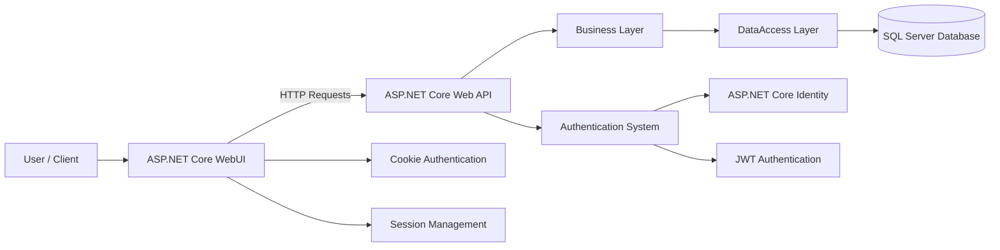
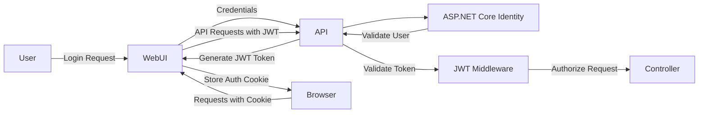

# 🛒 E-Commerce Web Application

Bu proje, **ASP.NET Core 8** kullanılarak geliştirilmiş, katmanlı mimariye sahip bir e-ticaret uygulamasıdır. Admin Paneli ve Kullanıcı Paneli bulunmaktadır.
Amaç, modern yazılım geliştirme pratiklerini uygulayarak öğrenmek ve gerçek hayata yakın bir sistem tasarlamaktır.  

---

# 🛒 Özet

- Site içerisinde ürünler listelenmektedir ve kullanıcı seçimine göre **renk, kategori, beden ve fiyat** filtreleme yapılabilir.  
- Ürün sepete eklenmek istendiğinde, kullanıcı **giriş yapmamışsa** "Giriş Yapınız" uyarısı alınır ve kullanıcı **Giriş / Kayıt ekranına yönlendirilir**.  
- Giriş yapan kullanıcı sepetini görüntülemek istediğinde:  
  - **Aktif sepet yoksa:** Yeni sepet oluşturulur, **Status** durumu `true` atanır ve kullanıcı ürün ekledikçe sepete eklenir.  
  - **Aktif sepet varsa:** Sepet sayfasında mevcut ürünler listelenir; kullanıcı yeni ürün eklediğinde **mevcut ürün güncellenir veya eklenir**. Bu işlemler **AJAX ile senkronize** şekilde yapılır.
- Sipariş Durumu ve Ödeme Durumu Takibi yapılmaktadır.

## 🛠️ Kullanılan Teknolojiler

### 🔹 Ana Teknolojiler
- **ASP.NET Core 8 (MVC + Web API)** → Uygulamanın temel çatısı, hem API hem WebUI geliştirme sağlandı.  
- **Entity Framework Core (Code First)** → Veritabanı işlemleri yönetildi, entityler arasında ilişkiler (1-N, N-N) kuruldu ve LINQ ile sorgulamalar yapıldı.  
- **Identity & JWT Authentication** → Kullanıcı giriş/çıkış süreçlerinde token tabanlı kimlik doğrulama yapıldı; ayrıca admin controller tarafında yetkilendirme ve sepet işlemlerinde güvenlik sağlandı.
  **JWT Token Konfigürasyonu** → API üzerinde gelen JWT token'ların doğrulanması sağlandı. 
  Kullanıcı adı token içindeki **Name claim** üzerinden çekilerek **`User.Identity.Name`** ile erişim sağlandı. 
  Bu sayede API endpoint’lerine güvenli erişim ve yetkilendirme gerçekleştirildi. 
- **AutoMapper** → Entity ↔ DTO dönüşümleri kolaylaştırıldı.  
  

  ### 🔹 Mimari ve Tasarım
- **CQRS + MediatR** → Komut ve sorgu işlemleri ayrılarak temiz mimari sağlandı. 
- **DTO (Data Transfer Object)** → Katmanlar arası veri taşınırken entity bağımlılığı azaltıldı ve güvenli veri transferi sağlandı.
- **ViewModel** → UI katmanına özel veri modelleri oluşturularak sayfaya taşınacak veriler düzenlendi ve View ile Controller arasındaki veri akışı kontrol altına alındı.
- **Repository Pattern** → Veri erişimi soyutlandı, test edilebilirlik ve esneklik sağlandı.

## 🔐 ASP.NET Core Identity + JWT + Cookie Authentication

Projede kullanıcı yönetimi ve kimlik doğrulama süreçleri için birden fazla güvenlik mekanizması birlikte kullanılmıştır.

### ASP.NET Core Identity

- Kullanıcı kayıt ve giriş işlemleri yönetilmiştir.
- `IdentityUser` yapısı kullanılarak kullanıcı verileri güvenli şekilde saklanmıştır.
- Şifre hashleme ve kullanıcı doğrulama işlemleri Identity tarafından sağlanmıştır.

### Role Based Redirect

- Kullanıcı giriş yaptıktan sonra rolüne göre yönlendirme yapılmıştır:
  - **Admin** rolündeki kullanıcılar → Admin Paneline yönlendirilir
  - **User** rolündeki kullanıcılar → Ana sayfaya yönlendirilir
    
### JWT (JSON Web Token) Authentication

API katmanında kullanıcı doğrulaması **JWT token tabanlı** olarak gerçekleştirilmiştir.

- Kullanıcı giriş yaptıktan sonra API tarafından bir **JWT Token** üretilmektedir.
- Token içerisinde kullanıcı bilgileri **claim** olarak saklanmaktadır.

### Cookie Authentication (WebUI)

WebUI tarafında kullanıcı oturumu **Cookie Authentication** kullanılarak yönetilmiştir.

- Kullanıcı giriş yaptıktan sonra oluşturulan **cookie** sayesinde kullanıcının oturum durumu korunmuştur.

### Session 

UI tarafında kullanıcı giriş durumunun kontrol edilmesi ve bazı kullanıcı bilgilerinin geçici olarak saklanması için **Session mekanizması** kullanılmıştır.
- **API tarafında stateless JWT güvenliği**
- **WebUI tarafında cookie tabanlı oturum yönetimi**

birlikte kullanılarak daha **esnek bir kimlik doğrulama sistemi** oluşturulmuştur.

## 🛠️ Seed Data – Roles & Admin User

Projede uygulama ilk çalıştırıldığında **roller ve admin kullanıcı** otomatik olarak oluşturulmaktadır.

1️⃣ **Role Oluşturma**
- `RoleManager<AppRole>` ile roller (`Admin`, `User`) kontrol edilir.
- Mevcut değilse, roller otomatik oluşturulur.

## 🛠️Exception Handling & Logging
- **IExceptionHandler** yapısı kullanılarak merkezi hata yönetimi (global exception handling) uygulandı.
- Hatalar, **custom exception handler sınıfları** üzerinden yönetildi. 
- Hata yanıtlarının standartlaştırılması için **Problem Details(RFC 7807**) kullanıldı.
- Her hata ayıklandığında loglanması için Handler sınıflarında **ILogger<T>** arayüzü uygulandı.

### 🔹 Diğer Teknolojiler & Best Practices
-**Areas (Admin Paneli Ayrımı)** → Admin paneli, uygulamadan bağımsız şekilde yönetilebilmesi için Area yapısı kullanılarak ayrıştırıldı. Böylece modüler ve daha düzenli bir proje yapısı oluşturuldu.
- **Dependency Injection** → Servislerin bağımlılıkları yönetildi, loosely coupled yapı kuruldu.  
- **LINQ** → Veriler üzerinde güçlü ve okunabilir sorgulamalar yapıldı.  
- **Fluent Validation / Data Annotations** → Kullanıcı girişleri ve modeller doğrulandı.
- **Enum Kullanımı** → Beden, renk ve sepet durumu (status), Api statusCode gibi sabit veri setleri enum ile tanımlanarak tip güvenliği sağlandı.
- **Model Binding** → HTTP isteklerindeki veriler otomatik olarak modellere bağlandı.  
- **RESTful API** → Katmanlar arası iletişim sağlandı; WebUI ve API arasında JSON tabanlı veri alışverişi yapıldı, HTTP metotları (GET, POST, PUT, DELETE) kullanıldı ve stateless yapısıyla ölçeklenebilirlik sağlandı.
- **Ajax & jQuery** → WebUI tarafında asenkron veri işlemleri yapıldı. (Sepet güncelleme işlemleri => ürün adeti arttırma/azaltma, toplam fiyat ; Ürün kategori seçimleri)
- **View Components** → Sayfa üzerinde birden fazla entity veya bileşen dinamik olarak gösterildi.
- **Partial View**
- **Layout**  

## 🏗️ Project Architecture

## 🔐 Authentication Flow

## 📸 Proje Görselleri

### Admin Paneli (Admin)
.png)
 

.png)
 

.png)
 

.png)
 

.png)
 

.png)
 

.png)
 

.png)
 

.png)
 

### Anasayfa (User)
.png)
 

#### Anasayfa -> Kategoriler
.png)
 

.png)
 
#### Custom Identity Description
.png)
 

.png)
 

.png)
 

.png)
 

.png)
 

.png)
 

.png)
 

.png)
 

.png)
 

